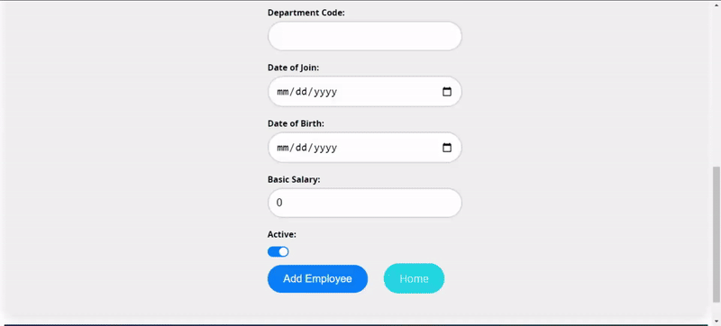

> ## Employee Management React App
### The application efficiently manages employee details by interacting with provided APIs. It features a responsive design and utilizes modern web development techniques for a seamless user experience. 

### The API endpoints for accessing employee and department data are provided through Swagger, with the base URL set to 

>http://examination.24x7retail.com


 ```jsx harmony
Application Functionalities
```


```jsx harmony
Custom Data Validations
```


>### Features

```console
1. Add New Employee: Easily add new employees to the system.
2. Edit Existing Employees: Update details of existing employees seamlessly.
3. Delete Employees: Remove employees from the database with a simple click.
4. Display Employee List: View a comprehensive list of all existing employees.
5. Search Functionality: Quickly search for specific employees using search functionality.
```

>### Technologies


#### Frontend:
```console
React.js
Sass for styling
React Router for client-side routing
```
#### Backend (Proxy Server):
```console
1. Express.js
2. Axios for making HTTP requests
3. CORS for enabling cross-origin resource sharing
```

### Why Proxy Server?
>CORS (Cross-Origin Resource Sharing) Issue

### When making requests from a client-side application (like a React app) to a different domain, CORS policies enforced by browsers restrict these requests. This can cause errors like "Access to XMLHttpRequest has been blocked" or "No 'Access-Control-Allow-Origin' header".

>API Security

#### Directly exposing sensitive APIs to the client-side poses security risks, such as exposing API keys or endpoints. A proxy server acts as a middleman, shielding the frontend from direct communication with the API and ensuring secure data transmission.

>Handling HTTP Requests
#### The proxy server serves as an intermediary for handling HTTP requests. It can preprocess requests, add headers, modify responses, or handle authentication, providing flexibility and control over how data is fetched and transmitted.

### Implementation in Node Server

```jsx harmony
// Define API endpoints
const baseURL = 'DEFINE_BASE_URL';
const apiToken = 'DEFINE_THE_API_KEY';
const headers = {
  'apiToken': apiToken,
  'Accept': 'application/json',
};

// Implement API routes
// Example: GET all employees
app.get('/api/v1.0/Employees', async (req, res) => {
  try {
    const response = await axiosInstance.get(`${baseURL}/Employees`, { headers });
    res.json(response.data);
  } catch (error) {
    console.error('Error fetching employees:', error.message);
    res.status(500).json({ error: 'Internal server error' });
  }
});
// Add more API routes...
```
```jsx harmony
Data Creation
```


```jsx harmony
Data Searching
```


```jsx harmony
Data Reading on Home Page
```


```jsx harmony
Data Reading 
```


```jsx harmony
Data Updating
```


